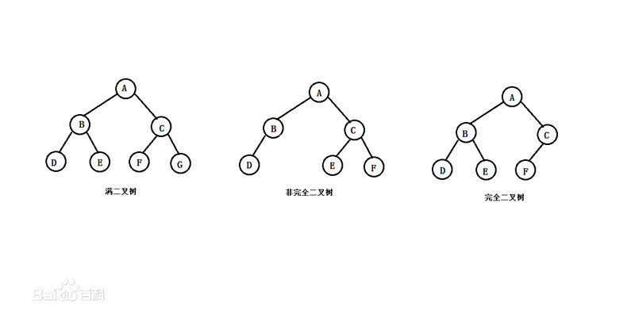

#### 无序

二叉树：
满二叉树：
完全二叉树：

平衡二叉树：它是一棵空树或它的左右两个子树的高度差的绝对值不超过1，并且左右两个子树都是一棵平衡二叉树

#### 有序

二叉查找(搜索)树：
1.左<root<右
2.有可能不平衡，最后退化成

AVL树：

1.本身首先是一棵二叉搜索树。

2.带有平衡条件：每个结点的左右子树的高度之差的绝对值（平衡因子）最多为1

https://zhuanlan.zhihu.com/p/34899732

[红黑树](../rbtree/RBTree.md)：是一种二叉查找树，相对与AVL树，效率较高。时间复杂度为O(log n)