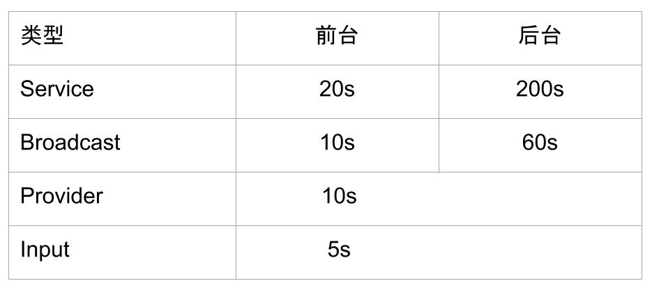

### ANR

#### Form [Google Doc](https://developer.android.com/topic/performance/vitals/anr)

1、应用在主线程上非常缓慢地执行涉及 I/O 的操作。

2、应用在主线程上进行长时间的计算。

3、主线程在对另一个进程进行同步 binder 调用，而后者需要很长时间才能返回。

4、主线程处于阻塞状态，为发生在另一个线程上的长操作等待同步的块。

5、主线程在进程中或通过 binder 调用与另一个线程之间发生死锁。主线程不只是在等待长操作执行完毕，而且处于死锁状态

#### [四大组件ANR时常](http://gityuan.com/2019/04/06/android-anr/)

#### Service 

其对应关系可粗略理解为Adj等于0的进程属于Top进程组，Adj等于100或者200的进程属于前台进程组，Adj大于200的进程属于后台进程组。

#### 广播

根据发送广播sendBroadcast(Intent intent)中的intent的flags是否包含FLAG_RECEIVER_FOREGROUND来决定把该广播是
放入前台广播队列或者后台广播队列，前台广播队列的超时为10s，后台广播队列的超时为60s，默认情况下广播是放入后台广播队列，
除非指明加上FLAG_RECEIVER_FOREGROUND标识。

另外，只有串行处理的广播才有超时机制，因为接收者是串行处理的，前一个receiver处理慢，会影响后一个receiver；并行广播通
过一个循环一次性向所有的receiver分发广播事件，所以不存在彼此影响的问题，则没有广播超时

当一个进程没有启动时，无论是启动Service还是接受广播，都有肯能造成ANR，主要原因时进程启动时间过长。

