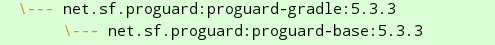

#### 查看编译环境依赖版本
./gradlew buildEnvironment


单独编译生成aar包，引用其他aar/lib包的两种方式：
```groovy
//1
implementation files('libs/lib_base.aar')
//2
implementation(name: 'lib_base', ext: 'aar')
```
方式1，能够编译到Release版本中，无法编译到Debug版本中(即开启代码混淆能有编译进aar中)
方式2，无法编译到Release/Debug版本中


#### 发布到本地Maven侧仓库
需要继承的task
```groovy
dependsOn: [ 'publishToMavenLocal']
```

引用：
```groovy
repositories {
        mavenLocal()
}

dependencies {
     // classpath
     classpath 'com.android.tools.build:gradle:3.2.1'
     classpath ("com.geektime.systrace:systrace-gradle-plugin:1.0") { changing = true }
 }
```
demo：https://github.com/AndroidAdvanceWithGeektime/Chapter07


#### 在编译任务开始之前执行task

preBuild.dependsOn taskA

#### 获取当前编译的flavor

gradle.getStartParameter().getTaskRequests().toString().toLowerCase()

https://stackoverflow.com/questions/30621183/how-to-get-current-flavor-in-gradle

用途：

1、指定不同的CMakeLists文件(比如：空文件)
```
    externalNativeBuild {
        cmake {
            path {
                //println '哈哈哈' + getGradle().getStartParameter().getTaskRequests().toString()
                if (gradle.getStartParameter().getTaskRequests().toString().toLowerCase().contains('flavor')) {
                    return file('../../css/CMakeLists.txt')
                } else {
                    return file('./CMakeLists.txt')
                }
            }
        }
    }
```