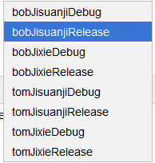

flavorDimensions 和 productFlavors

如下配置：
```groovy
    flavorDimensions "student", "banji"

    productFlavors {
        tom {
            dimension "student"
        }
        bob{
            dimension "student"
        }
        jisuanji {
            dimension "banji"
        }
        jixie {
            dimension "banji"
        }
    }
```
生成的编译选项：


不同dimension的flavor会相互组合。