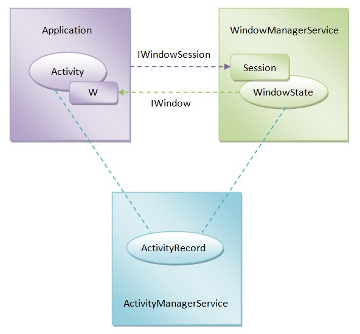

### Activity、AMS以及WMS之间的关系-Android 8.x



我们就可以通过WindowToken类的成员函数的asAppWindowToken()的返回值来判断一个WindowToken对象是否是AppWindowToken
用来描述一个Activity组件窗口的，即是用来描述一个应用程序窗口的。

WindowToken.java
```
    AppWindowToken asAppWindowToken() {
        // TODO: Not sure if this is the best way to handle this vs. using instanceof and casting.
        // I am not an app window token!
        return null;
    }
```


https://blog.csdn.net/Luoshengyang/article/details/8275938


1. ActivityManagerService服务请求WindowManagerService服务为一个Activity组件创建一个AppWindowToken对象的过程；

2. 应用程序进程请求WindowManagerService服务创建一个Session对象的过程；

3. 应用程序进程请求WindowManagerService服务为一个Activity组件创建一个WindowState对象的过程。

ActivityRecord.java，appToken初始化：
```
 ActivityRecord(ActivityManagerService _service, ProcessRecord _caller, int _launchedFromPid,
            int _launchedFromUid, String _launchedFromPackage, Intent _intent, String _resolvedType,
            ActivityInfo aInfo, Configuration _configuration,
            ActivityRecord _resultTo, String _resultWho, int _reqCode,
            boolean _componentSpecified, boolean _rootVoiceInteraction,
            ActivityStackSupervisor supervisor, ActivityOptions options,
            ActivityRecord sourceRecord) {
        service = _service;
        appToken = new Token(this);
        ...
    }
```

```
void createWindowContainer() {
        ...

        mWindowContainerController = new AppWindowContainerController(taskController, appToken,
                this, Integer.MAX_VALUE /* add on top */, info.screenOrientation, fullscreen,
                (info.flags & FLAG_SHOW_FOR_ALL_USERS) != 0, info.configChanges,
                task.voiceSession != null, mLaunchTaskBehind, isAlwaysFocusable(),
                appInfo.targetSdkVersion, mRotationAnimationHint,
                ActivityManagerService.getInputDispatchingTimeoutLocked(this) * 1000000L,
                getOverrideConfiguration(), mBounds);

        ...
    }
```
AppWindowContainerController.java
```
public AppWindowContainerController(TaskWindowContainerController taskController,
            IApplicationToken token, AppWindowContainerListener listener, int index,
            int requestedOrientation, boolean fullscreen, boolean showForAllUsers, int configChanges,
            boolean voiceInteraction, boolean launchTaskBehind, boolean alwaysFocusable,
            int targetSdkVersion, int rotationAnimationHint, long inputDispatchingTimeoutNanos,
            WindowManagerService service, Configuration overrideConfig, Rect bounds) {
        super(listener, service);
        mHandler = new H(service.mH.getLooper());
        mToken = token;
        synchronized(mWindowMap) {
            AppWindowToken atoken = mRoot.getAppWindowToken(mToken.asBinder());
            if (atoken != null) {
                // TODO: Should this throw an exception instead?
                Slog.w(TAG_WM, "Attempted to add existing app token: " + mToken);
                return;
            }

            final Task task = taskController.mContainer;
            if (task == null) {
                throw new IllegalArgumentException("AppWindowContainerController: invalid "
                        + " controller=" + taskController);
            }

            atoken = createAppWindow(mService, token, voiceInteraction, task.getDisplayContent(),
                    inputDispatchingTimeoutNanos, fullscreen, showForAllUsers, targetSdkVersion,
                    requestedOrientation, rotationAnimationHint, configChanges, launchTaskBehind,
                    alwaysFocusable, this, overrideConfig, bounds);
            if (DEBUG_TOKEN_MOVEMENT || DEBUG_ADD_REMOVE) Slog.v(TAG_WM, "addAppToken: " + atoken
                    + " controller=" + taskController + " at " + index);
            task.addChild(atoken, index);
        }
    }
```

```
    AppWindowToken createAppWindow(WindowManagerService service, IApplicationToken token,
            boolean voiceInteraction, DisplayContent dc, long inputDispatchingTimeoutNanos,
            boolean fullscreen, boolean showForAllUsers, int targetSdk, int orientation,
            int rotationAnimationHint, int configChanges, boolean launchTaskBehind,
            boolean alwaysFocusable, AppWindowContainerController controller,
            Configuration overrideConfig, Rect bounds) {
        return new AppWindowToken(service, token, voiceInteraction, dc,
                inputDispatchingTimeoutNanos, fullscreen, showForAllUsers, targetSdk, orientation,
                rotationAnimationHint, configChanges, launchTaskBehind, alwaysFocusable,
                controller, overrideConfig, bounds);
    }
```
以上是AMS创建Token的过程。

AMS传给Activity，IApplicationToken.Stub的实例appToken。
ActivityThread的handleResumeActivity()会在Activity的onResume之后，调用wm.addView(decor, l);最终实现为

WindowManagerGlobal.java

```
 public void addView(View view, ViewGroup.LayoutParams params,
            Display display, Window parentWindow) {
        ...
        ViewRootImpl root;
        ...
        root = new ViewRootImpl(view.getContext(), display);
        ...
        root.setView(view, wparams, panelParentView);
         ...
    }
```
ViewRootImpl.java
```
 public void setView(View view, WindowManager.LayoutParams attrs, View panelParentView) {
        ...
        try {
            mOrigWindowType = mWindowAttributes.type;
            mAttachInfo.mRecomputeGlobalAttributes = true;
            collectViewAttributes();
            res = mWindowSession.addToDisplay(mWindow, mSeq, mWindowAttributes,
                    getHostVisibility(), mDisplay.getDisplayId(),
                    mAttachInfo.mContentInsets, mAttachInfo.mStableInsets,
                    mAttachInfo.mOutsets, mInputChannel);
        } catch (RemoteException e) {
           ...
        }
        ...  
}
```
两个重要的参数：mWindow类型为W,另一个mDisplay.getDisplayId()