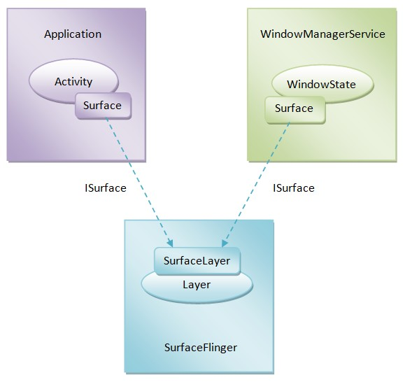

### Surface的创建过程
就是在在Java层实现的Android应用程序窗口的绘图表面是通过两个Surface对象来描述，一个是在应用程序进程这一侧创建的，
另一个是在WindowManagerService服务这一侧创建的，它们对应于SurfaceFlinger服务这一侧的同一个Layer对象。

关系如下图：

具体来说，就是位于应用程序进程这一侧的Surface对象负责绘制应用程序窗口的UI，即往应用程序窗口的图形缓冲区填充UI数据，
而位于WindowManagerService服务这一侧的Surface对象负责设置应用程序窗口的属性，例如位置、大小等属性。