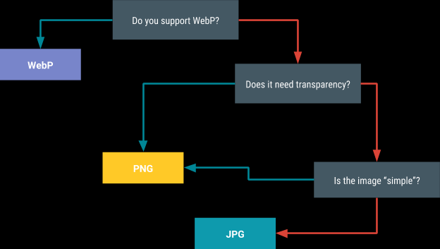

### Android图片优化
#### 格式的选择
主要有，
Jepg：细节较多的图片

Png：图片颜色单一，支持透明

Webp:Android 4.2.1开始

#### 编码

ALPHA_8：表示8位Alpha位图,即A=8,一个像素点占用1个字节,它没有颜色,只有透明度

ARGB_4444：表示16位ARGB位图，即A=4,R=4,G=4,B=4,一个像素点占4+4+4+4=16位，2个字节

ARGB_8888：表示32位ARGB位图，即A=8,R=8,G=8,B=8,一个像素点占8+8+8+8=32位，4个字节

RGB_565：表示16位RGB位图,即R=5,G=6,B=5,它没有透明度,一个像素点占5+6+5=16位，2个字节

#### 采样

顾名思义，图片的大小就是bitmap的宽高，按公式我们可以缩减bitmap的宽高来达到压缩图片占用内存的目的。
这种我们根据BitmapFactory 的采样率进行压缩 设置采样率，不能小于1 假如是2 则宽为之前的1/2，高为之前的1/2，一共缩小1/4。

#### 复用
图片复用指的是inBitmap这个属性：

这个属性又什么作用？
不使用这个属性，你加载三张图片，系统会给你分配三份内存空间，用于分别储存这三张图片
如果用了inBitmap这个属性，加载三张图片，这三张图片会指向同一块内存，而不用开辟三块内存空间
inBitmap的限制

- 3.0-4.3

1、复用的图片大小必须相同

2、编码必须相同

- 4.4以上

1、复用的空间大于等于即可

2、编码不必相同

-不支持WebP

-图片复用，这个属性必须设置为true；options.inMutable = true;

链接：https://juejin.im/post/5d5a865d518825053c7d7039
https://developer.android.com/topic/performance/graphics/manage-memory

#### 加载高清图

使用BitmapRegionDecoder这个类，加载图片的一部分区域
