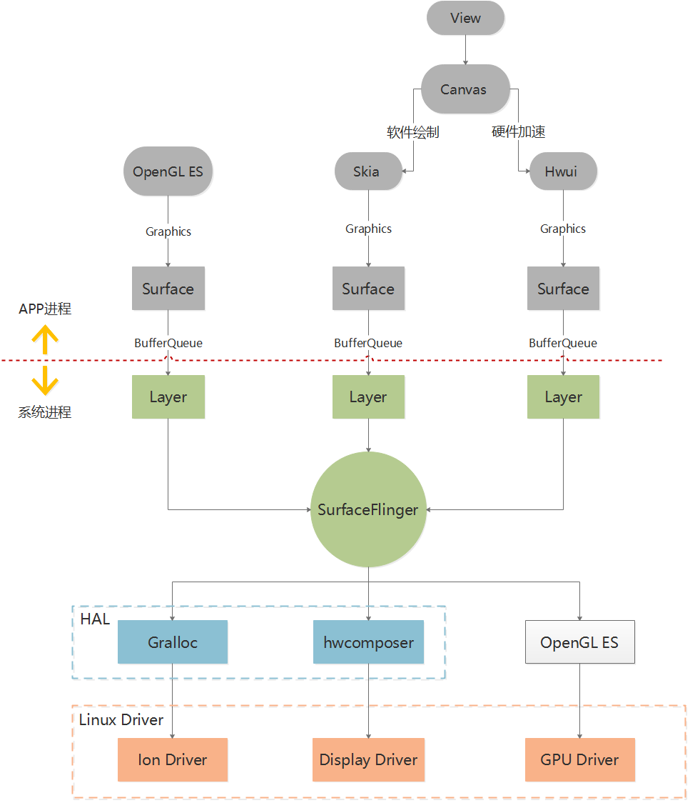

### Andorid 图形界面

Android View显示到屏幕上的过程：

Canvas
Surface
SurfaceFlinger
HWC
屏幕

ViewRootImpl源码

View的Canvas由Surface的lockCanvas()获取。
Surface mSurface = new Surface()

https://juejin.im/post/5d9090af518825323a37713d