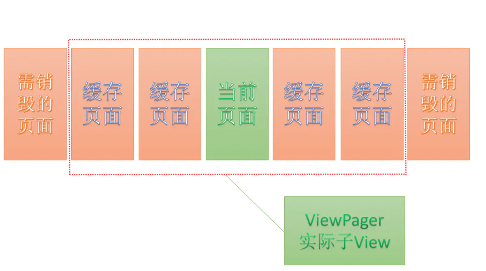

### ViewPager源码

主要方法populate()。默认只缓存前一个页面和后一个页面。通过setOffscreenPageLimit()控制缓存页面个数。

####FragmentPagerAdapter和FragmentStatePagerAdapter

FragmentPagerAdapter：适用少量页面。增加和销毁页面主要通过FragmentTransaction attach()和detach()页面。

FragmentStatePagerAdapter：适用页面比较多的情况。增加和销毁页面主要通过FragmentTransaction add()和remove()方法。