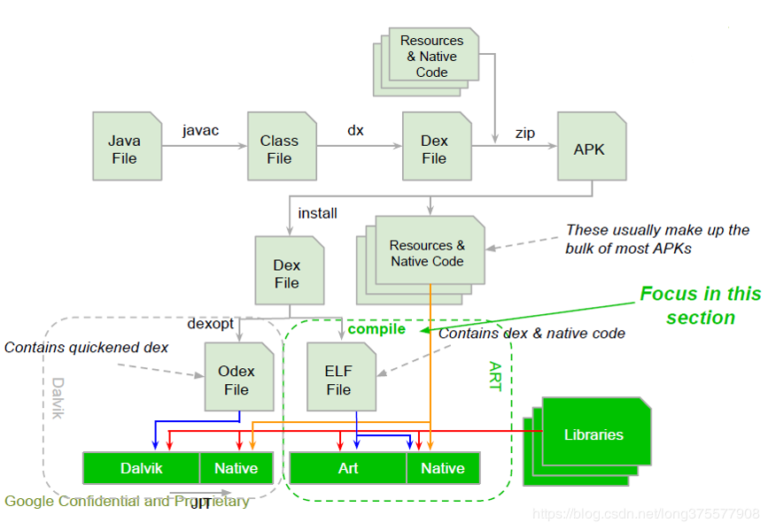

### dex2oat

dex2oat和dexopt执行流程图

#### 命令

可以在adb shell 下通过命令行方式直接发起dex2oat操作，例如强制编译微信：

adb shell cmd package compile -m speed-profile -f com.tencent.mm

清除配置文件数据并移除经过编译的代码：

adb shell cmd package compile --reset com.tencent.mm

