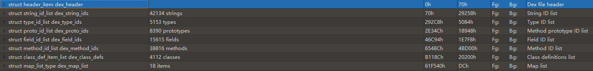
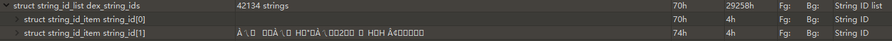

### Dex文件格式

分为三部分，图片中只包含前两部分，因为Data中的数据都是被前两部分引用的：

#### Header

包含每种数据的size和开始位置。因为每种数据的格式都是固定的，所以根据每种数据的开始位置和index（每种数据内部的index）就可以定位到每种
数据的实际位置。
以string_ids为例，index为1的string_id的实际位置为74h(开始位置为70h)：

### Index

包含各种数据的索引：

String的索引：

    Type索引：类名

proto_id：方法原型的索引，这样可以对相同原型，不同方法名的方法进行复用。

field_id:通过类名，Filed名和变量名就可以确定一个成员变量（这里不包含访问权限）

methed_id：通过类名，方法名和原型就可以确定一个方法（这里不包含访问权限）

class_def_item：访问权限，类名，父类，接口，注解，虚方法列表，直接方法列表，实例变量列表，类变量等。方法的方法体索引也在这里。

map_list:对于这个字段我的理解是这个数据结构在源码中有定义，可以直接反序列化成对象，这样使用比较方便。
>出现在数据区段中
>引用自 header_item
>对齐：4 个字节
>这是文件全部内容（依序显示）的列表。该列表包含关于 header_item 的一些冗余信息，但这些冗余信息存在的目的是提供一种用于
>遍历整个文件的简单方式。指定类型在映射中最多只能出现一次，但除了格式其余部分所隐含的限制条件（例如，header 区段必须先显示，
>随后是 string_ids 区段等等）之外，对于类型可以什么顺序显示，则没有任何限制。此外，映射条目必须按初始偏移量进行排序，不得重叠。

>https://source.android.com/devices/tech/dalvik/dex-format#map-list

#### Data

各种数据真实存在的位置。

具体参数可以参考：

https://www.jianshu.com/p/f7f0a712ddfe

https://source.android.com/devices/tech/dalvik/dex-format

dex文件格式查看可以使用：010Editor。

010Editor解析dex文件的脚本，参考：https://bbs.pediy.com/thread-208828.htm

