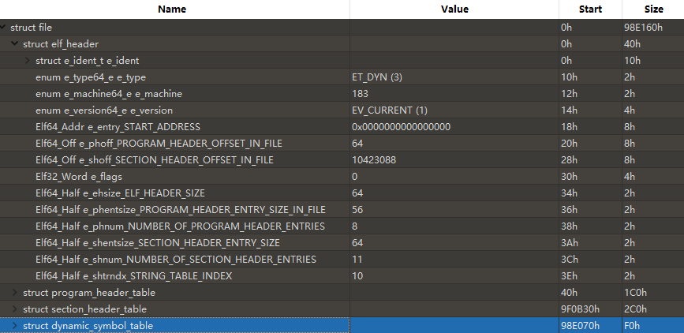
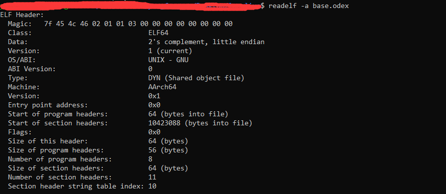
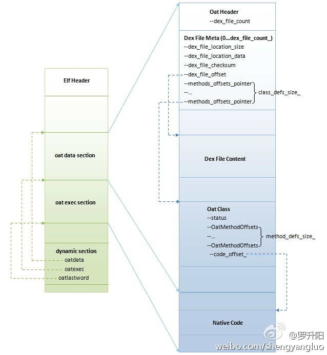

### Elf 文件格式

截图来自010 editor ，文件为Android的odex文件（dex经过dex2oat的文件），也是一个elf文件

主要分四部分：

elf header:主要用了描述文件版本号，格式等信息。从图中的名字我们可以推断header包含的信息。
（Value列的值为10进制，e_phentsize的value代表字节数，start和size是16进制-可以理解为是bit）

program header:

section header:

dynamic symbol:

罗升阳的图

>作为Android私有的一种ELF文件，OAT文件包含有两个特殊的段oatdata和oatexec，前者包含有用来生成本地机器指令的dex文件内容，
后者包含有生成的本地机器指令，它们之间的关系通过储存在oatdata段前面的oat头部描述。此外，在OAT文件的dynamic段，
导出了三个符号oatdata、oatexec和oatlastword，它们的值就是用来界定oatdata段和oatexec段的起止位置的。
其中，[oatdata, oatexec - 1]描述的是oatdata段的起止位置，而[oatexec, oatlastword + 3]描述的是oatexec的起止位置。

https://blog.csdn.net/Luoshengyang/article/details/39307813