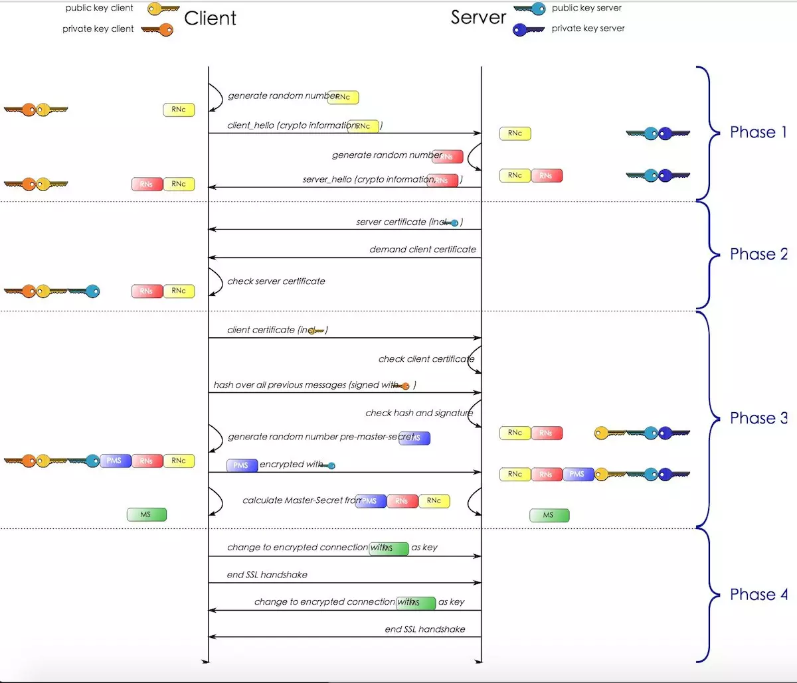
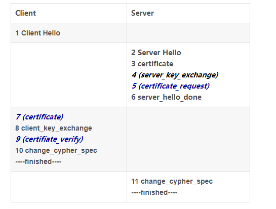
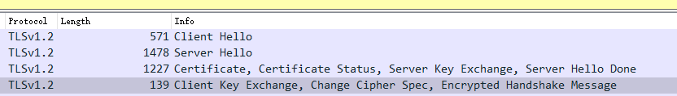
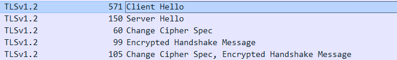
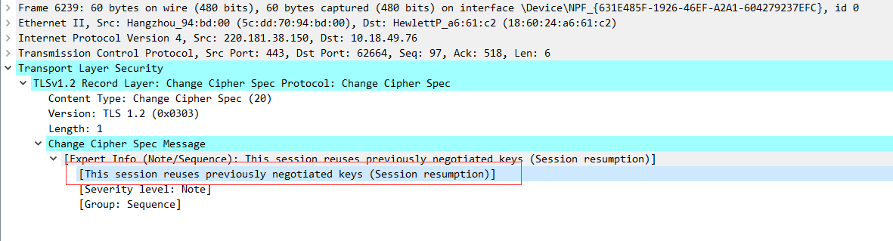

Https是在Http协议的底层增加一个SSL/TLS来实现。

原理：建立连接时，获取一个对称加密的秘钥A，用来在之后的通信过程中使用。而这个对称加密的秘钥A，是通过非对称加密的方式从服务端获取，
并且使用证书中的公钥进行解密。

#### 握手过程

步骤：

1 Client Hello	
生成Client random

2 Server Hello

生成Server random

3 certificate

4 (server_key_exchange)
5 (certificate_request)
6 server_hello_done
7 (certificate)
8 client_key_exchange

生成pre-master secret.然后通过证书里面的公钥加密发送给Server。Server收到pre-master然后用私钥解密。
此时Client和Server都有三个随机数。

如果是DH算法，这里发送的就是客户端的DH参数，之后服务器和客户端根据DH算法，各自计算出相同的pre-master secret。

>PS:这里使用RSA算法还是DH算法是不一样的。

9 (certifiate_verify)
10 change_cypher_spec
11 change_cypher_spec

参考：https://blog.csdn.net/fw0124/article/details/40983787

实例:

百度实例：

session 复用

WireShark抓包 ： https://www.cnblogs.com/linyfeng/p/9496126.html

[Https证书生成](自签名证书生成.md)

[Https证书校验](证书校验过程.md)
 
https://www.ssl.com/article/browsers-and-certificate-validation/#

Https证书过期

https://juejin.im/post/5e689e336fb9a07c9e1c3903

。 

