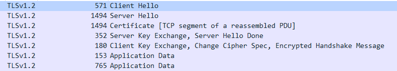
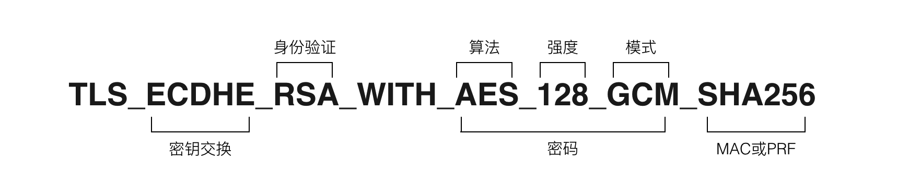

#### 影响握手过程的因素

- 握手过程使用RSA还是DH（ECDH）算法交换秘钥

- 是否开启客户端验证

#### 完整流程

1 Client Hello	

2 Server Hello

3 certificate

4 (server_key_exchange)  //开启DH算法时才有

5 (certificate_request)  //开启客户端验证时才有

6 server_hello_done

7 (certificate)         //开启客户端验证时才有

8 client_key_exchange

9 (certifiate_verify)  ////开启客户端验证时才有

10 change_cypher_spec

11 change_cypher_spec

参考：https://blog.csdn.net/fw0124/article/details/40983787

使用RSA算法握手过程：待截图
使用DH算法握手过程
开启双向校验握手过程：待截图

Client Say Hello：

加密套件格式解释：

参考：https://razeencheng.com/post/ssl-handshake-detail

Server Key Exchange：

Named Curve: secp256r1 (0x0017)   //secp256r1是官方已经定义好的曲线方程

Pubkey: 043d0f6c38358e0b5b1e3b2c2b0ed5b71df58dd351f82d80...  

//第1个字节04表示后面的数据没有压缩过. 此时, 随后的32字节为x坐标, 最后32字节为y坐标

Client Key Exchange类似

参考：https://blog.csdn.net/wzj_whut/article/details/86659577

PS:使用DH算法需要在服务端配置 https://www.jianshu.com/p/280de4af8c00

其他具体详细过程见：https://razeencheng.com/post/ssl-handshake-detail
