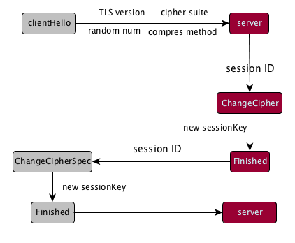

### Http优化

1、不是使用DNS，直接使用ip。可以在应用初始化的时候获取相应的ip。

2、减少连接服务器个数-统一域名，达到减少DNS次数的目的。

3、使用Http 2.0，需要服务端支持

4、CDN

#### Session Id复用

https://juejin.im/post/5b305758e51d4558ce5ea0d9#heading-19

Session ID 是 server 将上一次成功连接的 session 内容存在自己的硬盘里面。这里，就不涉及对 session data 的二次加密。
基本的过程是：

- client 端在 clientHello 阶段，将 random num，TLS protocol 和通过 hostname 匹配到的最新一次的 session ID 
发送给 server 端。（也就是说，client 同样需要存储一份 session data）

- server 接收到 session ID 后，在缓存中查找，如果找到，则直接进行 ChangeCipher 阶段，开始生成sessionKey。然后，
返回相同的 sessionID 即可。

那么相对于完全的 TLS/SSL 连接来说，这里只用到了一次 RTT。那么协议过程就变为了：

#### 参考文章

TLS 握手优化详解：https://imququ.com/post/optimize-tls-handshake.html

美团点评移动网络优化实践：https://tech.meituan.com/2017/03/17/shark-sdk.html