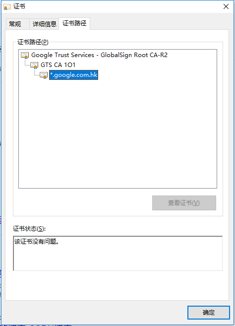

### 数字证书

加密方式：

对称加密
非对称加密

数字签名：
md5

Server向Client发送文件A：

对文件A进行数字签名，生成签名。

为了保证文件A不被篡改（A没有加密），Server对签名使用私钥进行非对称加密。Service发送给Client的信息包括：文件A，文件A的签名算法，文件A的签名。

Client用公钥进行解密拿到签名1，然后使用Server发送过来的文件进行签名，得到签名2；如果签名1和签名2一直，表示文件A没有别篡改。

Client获取的公钥无法保证是Server发送过来的，需要找一个权威机构来证明公钥是Server的。这个权威机构就是CA。CA证明的方式就是把
Server的相关信息和公钥进行绑定生成一个数字证书。

数字证书包含的信息

以google的一个证书为例，证书链：



证书保存为google.crt.cer，使用如下命令查看信息：
```shell script
openssl x509 -in google.crt.cer   -noout -text
```
输出：
```shell script
Certificate:
    Data:
        Version: 3 (0x2)
        Serial Number:
            67:43:41:48:52:b8:64:9e:08:00:00:00:00:3e:be:97
    Signature Algorithm: sha256WithRSAEncryption
        Issuer: C=US, O=Google Trust Services, CN=GTS CA 1O1
        Validity
            Not Before: May  5 08:33:35 2020 GMT
            Not After : Jul 28 08:33:35 2020 GMT
        Subject: C=US, ST=California, L=Mountain View, O=Google LLC, CN=*.google.com.hk
        Subject Public Key Info:
            Public Key Algorithm: id-ecPublicKey
                Public-Key: (256 bit)
                pub:
                    04:00:ae:a3:43:d4:7d:01:ce:2c:81:af:51:6d:13:
                    66:08:fe:41:ad:bb:cf:c7:0d:c4:50:16:1a:17:c3:
                    17:81:57:b6:c9:17:6e:f0:97:f9:ba:2b:00:6a:47:
                    9b:ae:e4:38:a9:44:0b:1b:c4:db:77:a4:11:f6:0e:
                    fd:3e:69:6b:dd
                ASN1 OID: prime256v1
                NIST CURVE: P-256
        X509v3 extensions:
            X509v3 Key Usage: critical
                Digital Signature
            X509v3 Extended Key Usage:
                TLS Web Server Authentication
            X509v3 Basic Constraints: critical
                CA:FALSE
            X509v3 Subject Key Identifier:
                A7:D0:7F:5E:CC:71:17:77:4F:62:49:6A:0E:51:AB:3D:A1:0A:E2:5A
            X509v3 Authority Key Identifier:
                keyid:98:D1:F8:6E:10:EB:CF:9B:EC:60:9F:18:90:1B:A0:EB:7D:09:FD:2B

            Authority Information Access:
                OCSP - URI:http://ocsp.pki.goog/gts1o1
                CA Issuers - URI:http://pki.goog/gsr2/GTS1O1.crt

            X509v3 Subject Alternative Name:
                DNS:*.google.com.hk, DNS:google.com.hk
            X509v3 Certificate Policies:
                Policy: 2.23.140.1.2.2
                Policy: 1.3.6.1.4.1.11129.2.5.3

            X509v3 CRL Distribution Points:

                Full Name:
                  URI:http://crl.pki.goog/GTS1O1.crl

            CT Precertificate SCTs:
                Signed Certificate Timestamp:
                    Version   : v1(0)
                    Log ID    : B2:1E:05:CC:8B:A2:CD:8A:20:4E:87:66:F9:2B:B9:8A:
                                25:20:67:6B:DA:FA:70:E7:B2:49:53:2D:EF:8B:90:5E
                    Timestamp : May  5 09:33:35.771 2020 GMT
                    Extensions: none
                    Signature : ecdsa-with-SHA256
                                30:45:02:21:00:A1:27:7F:85:40:02:B6:2F:E2:8A:A9:
                                C7:D8:EB:45:62:9C:DA:ED:7D:15:2E:49:86:08:C1:BA:
                                ED:32:20:50:B1:02:20:68:AA:1A:6F:FF:9C:D8:33:9D:
                                7C:6F:6B:E2:D4:1D:EE:3C:2C:89:DD:78:53:3D:BC:F2:
                                AB:AE:65:C2:C3:85:DA
                Signed Certificate Timestamp:
                    Version   : v1(0)
                    Log ID    : 5E:A7:73:F9:DF:56:C0:E7:B5:36:48:7D:D0:49:E0:32:
                                7A:91:9A:0C:84:A1:12:12:84:18:75:96:81:71:45:58
                    Timestamp : May  5 09:33:35.793 2020 GMT
                    Extensions: none
                    Signature : ecdsa-with-SHA256
                                30:46:02:21:00:EC:BC:58:2B:BC:D1:E5:71:9F:D4:75:
                                69:0C:72:F5:78:C1:CC:FE:53:C9:B1:53:17:ED:31:14:
                                94:FC:A3:0C:44:02:21:00:81:FA:E2:39:99:ED:CC:C0:
                                8E:7C:D6:90:4C:48:78:2A:68:57:F6:A5:E1:8A:0E:33:
                                42:99:2C:20:EE:A1:FF:76
    Signature Algorithm: sha256WithRSAEncryption
         0e:04:e3:cc:d8:c5:3e:bd:97:92:ba:49:e7:17:97:00:c1:67:
         6d:f9:17:bc:d1:e6:64:b6:4c:ca:d9:b5:c7:e0:a1:c0:ef:cf:
         a7:a0:b2:05:57:c3:50:c7:17:de:e1:23:17:a3:55:a1:f6:5f:
         1c:59:3a:5a:fc:58:be:ff:bb:f3:4a:47:a4:4d:51:50:53:35:
         9f:ad:6c:99:e9:09:1e:a4:3c:a7:05:b6:d2:c2:e2:d5:98:ab:
         2b:a5:ae:b8:ef:3b:c6:1d:97:f3:d3:ae:ea:c5:cd:50:5d:d6:
         78:92:b7:bf:fb:0a:45:78:f3:43:40:d6:44:b0:ae:aa:8a:74:
         15:b5:d6:cb:8f:40:fe:08:93:6f:d4:2a:af:b4:c1:08:fa:c4:
         b8:c7:26:49:f0:80:0a:6f:50:5f:2d:59:d8:8d:9e:68:44:04:
         d9:ec:f1:d1:db:03:44:89:93:f8:5f:b7:a1:16:c0:ea:1b:17:
         f2:8e:d1:8f:ab:ac:b0:78:08:41:35:aa:06:8d:35:fa:15:6a:
         a7:eb:ed:4e:f6:59:56:5e:7c:99:17:90:2a:92:2f:53:81:e8:
         0f:3c:55:97:cc:56:b8:f9:18:53:e9:a9:7b:f1:65:ca:14:c9:
         be:22:33:0f:0d:f1:01:a8:3b:3c:08:32:3a:7f:c4:bd:23:0c:
         12:b8:c0:5b

```
中间证书地址，当缺少中间证书是，Client就可以从这里下载，参考https://www.myssl.cn/home/article-0406-42.html：
```shell script
            Authority Information Access:
                OCSP - URI:http://ocsp.pki.goog/gts1o1
                CA Issuers - URI:http://pki.goog/gsr2/GTS1O1.crt

```
CA
```
        Issuer: C=US, O=Google Trust Services, CN=GTS CA 1O1
```