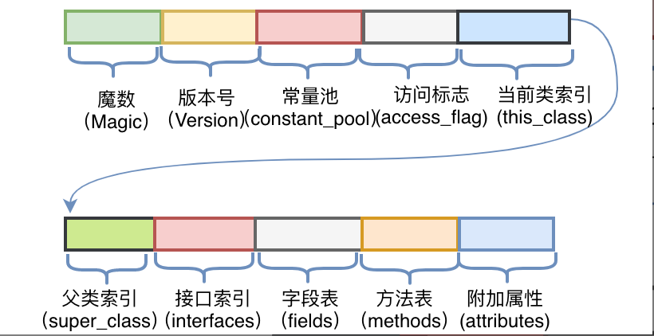

### 字节码

魔数：魔数的固定·值为：0xCAFEBABE

版本号

常量池：

- 字面量：字面量为代码中声明为Final的常量值

- 符号引用：符号引用如类和接口的全局限定名、字段的名称和描述符、方法的名称和描述符

访问标志
当前类索引
父类索引
接口索引
字段表
方法表
附加属性

#### 内部类

内部类持有外部类的引用，如果多层内部类嵌套，则只持有最近的一层外部类的引用，通过这种链式的持有引用，内部类就可以获取到所有的外部类对象。

调用方法指令：

1、invokespecial：调用私有实例方法；

2、invokestatic：调用静态方法；

3、invokevirtual：调用实例方法；

4、invokeinterface：调用接口方法;

5、invokedynamic：调用动态方法；