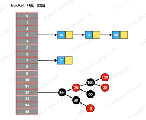

Java8版本的HashMap

#### 原理：通过Hash算法找到key对应的位置，会有Hash冲突，需要解决冲突。

#### Hash桶的数据结构：数组+链表+红黑树

{:height="50%" width="50%"}

#### 扩容机制：
1、扩充到原来的二倍，初始容量为16

#### 位置计算方法：
```java
 static final int hash(Object key) {
        int h;
        return (key == null) ? 0 : (h = key.hashCode()) ^ (h >>> 16);
    }
```
高16位与低16位进行异或运算减少hash冲突。

#### 初始容量16：
```java
    /**
     * The default initial capacity - MUST be a power of two.
     */
    static final int DEFAULT_INITIAL_CAPACITY = 1 << 4; // aka 16
```
```
 final V putVal(int hash, K key, V value, boolean onlyIfAbsent,
                   boolean evict) {
        Node<K,V>[] tab; Node<K,V> p; int n, i;
        if ((tab = table) == null || (n = tab.length) == 0)
            n = (tab = resize()).length;
        if ((p = tab[i = (n - 1) & hash]) == null)//该位置没有node，直接放到该位置
            tab[i] = newNode(hash, key, value, null);
        else {
            Node<K,V> e; K k;
            if (p.hash == hash &&
                ((k = p.key) == key || (key != null && key.equals(k))))//该位置有node，并且就是key相同的node，先记录下来
                e = p;
            else if (p instanceof TreeNode)//该位置已经是红黑树，直接增加到树节点
                e = ((TreeNode<K,V>)p).putTreeVal(this, tab, hash, key, value);
            else {//该位置已经有node，但是还没有变成树
                for (int binCount = 0; ; ++binCount) {
                    if ((e = p.next) == null) {
                        p.next = newNode(hash, key, value, null);
                        if (binCount >= TREEIFY_THRESHOLD - 1) // -1 for 1st//数量 =8变树
                            treeifyBin(tab, hash);
                        break;
                    }
                    if (e.hash == hash &&
                        ((k = e.key) == key || (key != null && key.equals(k))))
                        break;
                    p = e;
                }
            }
            if (e != null) { // existing mapping for key-即已经存在Map中，直接替换value，不需要resize
                V oldValue = e.value;
                if (!onlyIfAbsent || oldValue == null)
                    e.value = value;
                afterNodeAccess(e);
                return oldValue;
            }
        }
        ++modCount;//node 不存在map中
        if (++size > threshold)
            resize();
        afterNodeInsertion(evict);
        return null;
    }
```

详细分析：https://segmentfault.com/a/1190000012926722