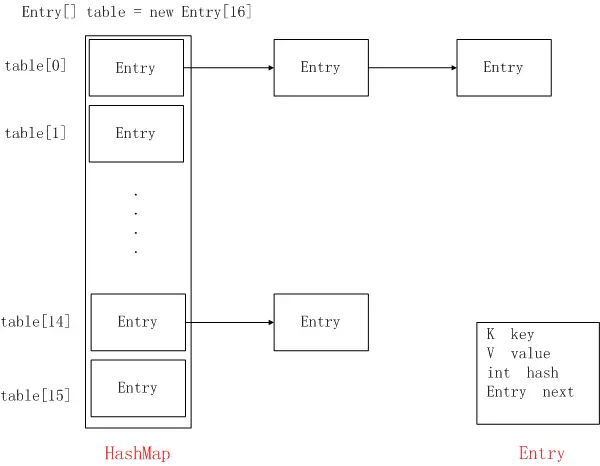
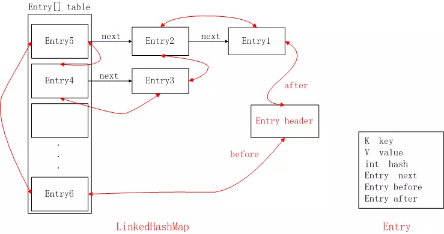

### LinkedHashMap

- LinkedHashMap是继承于HashMap，是基于HashMap和双向链表来实现的。
- HashMap无序；LinkedHashMap有序，可分为插入顺序和访问顺序两种。如果是访问顺序，那put和get操作已存在的Entry时，都会把Entry移动到双向链表的表尾(其实是先删除再插入)。
- LinkedHashMap存取数据，还是跟HashMap一样使用的Entry[]的方式，双向链表只是为了保证顺序。
- LinkedHashMap是线程不安全的

#### HashMap

#### LinkedHashMap

https://www.jianshu.com/p/8f4f58b4b8ab