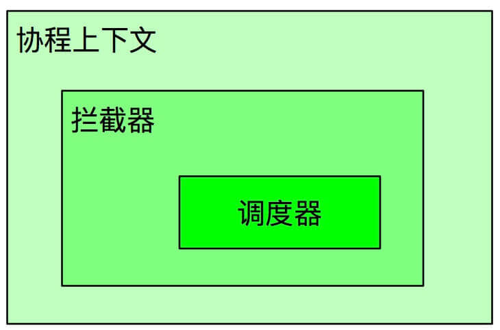

//协程就是Kotlin提供的一套线程切换的API(一个框架)
### 协程


#### 理解：

1、协程用途：把异步代码写成同步代码。eg.网络请求。

提供不阻塞挂起（内部实现：状态机）

2、异步代码的特性：异步代码不一定是多线程（并发），单线程也可以，比如Android 的Handler机制。

3、Kotlin对协程的实现：是多线程的，即协程可以在多线程中执行，也可以在单线程里执行。

#### 不阻塞挂起
>
非阻塞式是相对阻塞式而言的。

编程语言中的很多概念其实都来源于生活，就像脱口秀的段子一样。

线程阻塞很好理解，现实中的例子就是交通堵塞，它的核心有 3 点：

前面有障碍物，你过不去（线程卡了）
需要等障碍物清除后才能过去（耗时任务结束）
除非你绕道而行（切到别的线程）
从语义上理解「非阻塞式挂起」，讲的是「非阻塞式」这个是挂起的一个特点，也就是说，协程的挂起，就是非阻塞式的，协程是不讲「阻塞式的挂起」的概念的。

我们讲「非阻塞式挂起」，其实它有几个前提：并没有限定在一个线程里说这件事，因为挂起这件事，本来就是涉及到多线程。

就像视频里讲的，阻塞不阻塞，都是针对单线程讲的，一旦切了线程，肯定是非阻塞的，你都跑到别的线程了，之前的线程就自由了，可以继续做别的事情了。

所以「非阻塞式挂起」，其实就是在讲协程在挂起的同时切线程这件事情。

#### 关键概念：阻塞点

每一个阻塞点对应状态机的一种状态，每个状态都保存在相关的对象中。

#### Kotlin中协程的表现

1、语法上异步代码没有回调

2、底层使用Java线程池在实现并发操作。

#### Kotlin中协程的实现

1、提供了协程调度（协作），协程取消等功能

2、底层原理是使用Java的线程池。

#### 协程的是在启动模式
DEFAULT	立即执行协程体

ATOMIC	立即执行协程体，但在开始运行之前无法取消

UNDISPATCHED	立即在当前线程执行协程体，直到第一个 suspend 调用

LAZY	只有在需要的情况下运行



### 

1、Job 完成时是没有返回值的，如果需要返回值的话，应该使用 Deferred，它是 Job 的子类public interface Deferred<out T> : Job

```
将 launch 协程封装为 ResumeAwaitOnCompletion 作为 handler 节点添加到 aynsc 协程的 state.list，
然后在 async 协程完成时会通知 handler 节点调用 launch 协程的 resume(result) 方法将结果传给 launch 协程，
并恢复 launch 协程继续执行 await 挂起点之后的逻辑。
```