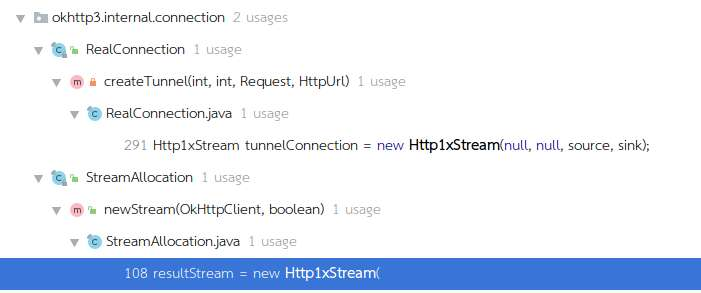

OkHttp责任链模式：
```
  private Response getResponseWithInterceptorChain() throws IOException {
    // Build a full stack of interceptors.
    List<Interceptor> interceptors = new ArrayList<>();
    interceptors.addAll(client.interceptors());
    interceptors.add(retryAndFollowUpInterceptor);
    interceptors.add(new BridgeInterceptor(client.cookieJar()));
    interceptors.add(new CacheInterceptor(client.internalCache()));
    interceptors.add(new ConnectInterceptor(client));
    if (!retryAndFollowUpInterceptor.isForWebSocket()) {
      interceptors.addAll(client.networkInterceptors());
    }
    interceptors.add(new CallServerInterceptor(
        retryAndFollowUpInterceptor.isForWebSocket()));

    Interceptor.Chain chain = new RealInterceptorChain(
        interceptors, null, null, null, 0, originalRequest);
    return chain.proceed(originalRequest);
  }
```
从责任链的最后一环CallServerInterceptor开始，主要它是最后一个添加的，并且通过这个类的注解也可以确定：

```
/** This is the last interceptor in the chain. It makes a network call to the server. */
public final class CallServerInterceptor implements Interceptor {
  ...
  @Override public Response intercept(Chain chain) throws IOException {
    HttpStream httpStream = ((RealInterceptorChain) chain).httpStream();
    StreamAllocation streamAllocation = ((RealInterceptorChain) chain).streamAllocation();
    Request request = chain.request();

    long sentRequestMillis = System.currentTimeMillis();
    //写入header
    httpStream.writeRequestHeaders(request);

    //如果有body，则写入body
    if (HttpMethod.permitsRequestBody(request.method()) && request.body() != null) {
      Sink requestBodyOut = httpStream.createRequestBody(request, request.body().contentLength());
      BufferedSink bufferedRequestBody = Okio.buffer(requestBodyOut);
      request.body().writeTo(bufferedRequestBody);
      bufferedRequestBody.close();
    }
    //完成数据request
    httpStream.finishRequest();

    Response response = httpStream.readResponseHeaders()
        .request(request)
        .handshake(streamAllocation.connection().handshake())
        .sentRequestAtMillis(sentRequestMillis)
        .receivedResponseAtMillis(System.currentTimeMillis())
        .build();
    ...

    return response;
  }
}

```
一次网络请求，包括两步：

1.发起request

2.接收response

httpStream.finishRequest();完成了第一步；这个方法的实现类有两个，分别实现了http1.1和http2.0协议。这里我们先分析http1.1，即Http1xStream类：

通过分析httpStream.finishRequest();前面的操作都是往一个通道BufferedSink sink中发送数据。其内部使用的okio来进行数据读写操作。

通过代码HttpStream httpStream = ((RealInterceptorChain) chain).httpStream();知道这一步只是获取httpStream，真正的实例化不是在这一步。
通过Http1xStream的构造方法的调用，可以发现被两个类调用，但是暂时不能确定是哪个地方初始化的。


我们继续看上一步ConnectInterceptor：
```
/** Opens a connection to the target server and proceeds to the next interceptor. */
public final class ConnectInterceptor implements Interceptor {
  public final OkHttpClient client;

  public ConnectInterceptor(OkHttpClient client) {
    this.client = client;
  }

  @Override public Response intercept(Chain chain) throws IOException {
    RealInterceptorChain realChain = (RealInterceptorChain) chain;
    Request request = realChain.request();
    StreamAllocation streamAllocation = realChain.streamAllocation();

    // We need the network to satisfy this request. Possibly for validating a conditional GET.
    boolean doExtensiveHealthChecks = !request.method().equals("GET");
    HttpStream httpStream = streamAllocation.newStream(client, doExtensiveHealthChecks);
    RealConnection connection = streamAllocation.connection();

    return realChain.proceed(request, streamAllocation, httpStream, connection);
  }
}
```
HttpStream httpStream = streamAllocation.newStream(client, doExtensiveHealthChecks);正是Http1xStream类一个初始化调用的地方
```
public HttpStream newStream(OkHttpClient client, boolean doExtensiveHealthChecks) {
    int connectTimeout = client.connectTimeoutMillis();
    int readTimeout = client.readTimeoutMillis();
    int writeTimeout = client.writeTimeoutMillis();
    boolean connectionRetryEnabled = client.retryOnConnectionFailure();

    try {
      RealConnection resultConnection = findHealthyConnection(connectTimeout, readTimeout,
          writeTimeout, connectionRetryEnabled, doExtensiveHealthChecks);

      HttpStream resultStream;
      if (resultConnection.framedConnection != null) {
        resultStream = new Http2xStream(client, this, resultConnection.framedConnection);
      } else {
        resultConnection.socket().setSoTimeout(readTimeout);
        resultConnection.source.timeout().timeout(readTimeout, MILLISECONDS);
        resultConnection.sink.timeout().timeout(writeTimeout, MILLISECONDS);
        resultStream = new Http1xStream(
            client, this, resultConnection.source, resultConnection.sink);
      }

      synchronized (connectionPool) {
        stream = resultStream;
        return resultStream;
      }
    } catch (IOException e) {
      throw new RouteException(e);
    }
  }
```
通过new Http1xStream(client, this, resultConnection.source, resultConnection.sink);
查看RealConnection resultConnection的source和sink
```
  private void connectSocket(int connectTimeout, int readTimeout) throws IOException {
    Proxy proxy = route.proxy();
    Address address = route.address();

    rawSocket = proxy.type() == Proxy.Type.DIRECT || proxy.type() == Proxy.Type.HTTP
        ? address.socketFactory().createSocket()
        : new Socket(proxy);

    rawSocket.setSoTimeout(readTimeout);
    try {
      Platform.get().connectSocket(rawSocket, route.socketAddress(), connectTimeout);
    } catch (ConnectException e) {
      throw new ConnectException("Failed to connect to " + route.socketAddress());
    }
    source = Okio.buffer(Okio.source(rawSocket));
    sink = Okio.buffer(Okio.sink(rawSocket));
  }
```
来自rawSocket，它是一个Socket,Platform.get().connectSocket(rawSocket, route.socketAddress(), connectTimeout);
```
 public void connectSocket(Socket socket, InetSocketAddress address,
      int connectTimeout) throws IOException {
    socket.connect(address, connectTimeout);
  }
```
通过socket建立连接，
source = Okio.buffer(Okio.source(rawSocket));

sink = Okio.buffer(Okio.sink(rawSocket));
获取读写流。
从这里可以看出，okhttp通过Socket对http协议进行了实现，并且使用okio对数据流进行操作，优化的读写速度。并且解决Android不同版本HttpUrlConnection
的兼容问题，最后优秀到被Google直接集成到新版的Android系统中，作为Android Http连接的默认实现。
